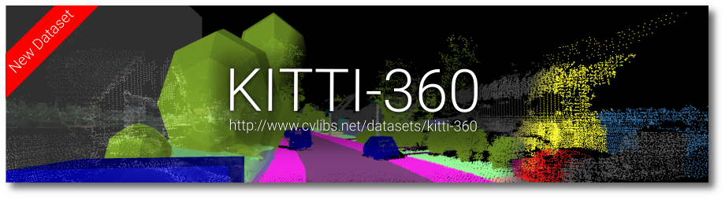

# 자율주행 인지 관련 Open DataSet 정리

# 1. KITTI

> Papar: [Are we ready for Autonomous Driving?](http://www.cvlibs.net/publications/Geiger2012CVPR.pdf)

## 1.1 개요

---

http://www.cvlibs.net/datasets/kitti-360/images/banner_text.png

KITTI 데이터셋은 카를스루에 공과대학(KIT, Karlsruhe Institute of Technology)과 시카고 토요타 기술 연구소(TTIC, Toyota Technological Institute at Chicago)가 2012년 합작해 만들어낸 프로젝트이다. 아래와 같은 차량(Annieway)을 통해 데이터를 수집했으며, 자율주행을 위한 현실적이고 높은 난이도의 데이터셋을 만드는 것을 목표로 하였다.

그림 1: [http://www.cvlibs.net/datasets/kitti/](http://www.cvlibs.net/datasets/kitti/)

이 차량에는 아래와 같은 센서가 부착되어있다. 

- 2개의 1.4 메가 픽셀 Point Grey Color Camera
- 2개의 1.4 메가 픽셀 Point Grey Grayscale Camera
- 1개의 3D Velodyne HDL-64E Lidar
- 1개의 GPS

이 센서들을 통해 수집된 데이터는 stereo, optical flow, visual odometry, 3D object detection,  3D tracking 등을 연구할 수 있도록 구성이 되어 있다. 센서 데이터 측정은 Karlsruhe 라는 도시 주변에 있는 도심 지역(rural area)과 고속도로(highway)에서 이루어졌다.

KITTI 데이터셋은 대략 아래와 같이 구성되어 있다

- **전체 데이터셋 크기** : ~ 40GB
- **데이터셋 종류**
    - stereo
    - flow
    - sceneflow
    - depth completion
    - single image depth prediction
    - visual odometry
    - 3d object detection
    - multi-object tracking
    - road/lane detection 10 semantic and instance segmentation

이들 중 대표적인 몇가지 데이터셋의 양, 세부요소, 활용 등을 분석해보았다.

## 1.2 데이터 종류 및 설명

---

### 1.2.1 Stereo / Flow

첫번째로 Stereo/Flow 데이터가 있다. 이 데이터는 총 194개의 학습 이미지 쌍과 195개의 테스트 이미지 쌍으로 구성되어 있으며 모두 손실이 거의 없는 png 포맷으로 이루어져 있다. Stereo 각 데이터의 특징을 살펴본다.

**스테레오(stereo)**는 일반 단안 카메라(mono camera)와는 다르게 두개의 카메라를 사용한다. 이때 하나의 스테레오 이미지 쌍을 얻을 수 있으며, stereo matching을 통해 양 이미지 사이의 시차(disparity)를 이용한 **거리 측정**이 가능하다. 카메라를 통해 물체까지의 거리를 인식해야 할 때에는 이 스테레오 데이터를 이용해서 측정이 가능하다. 이 데이터셋에는 실제 변위 데이터가 대략 50% 픽셀에 포함이 되어있다. *그림 2*는 스테레오 이미지를 시각화 한 것이다.

그림 2: [http://www.cvlibs.net/datasets/kitti/images/header_stereo.jpg](http://www.cvlibs.net/datasets/kitti/images/header_stereo.jpg)

**옵티컬 플로우(flow)**는 한 카메라로 연속적인 촬영을 수행함으로써 생성하는 데이터로, 카메라의 움직임에 대한 정보를 얻을 수 있다. *그림 3*은 옵티컬 플로우를 시각화 한 것이다.

그림 3: [http://www.cvlibs.net/datasets/kitti/images/header_flow.jpg](http://www.cvlibs.net/datasets/kitti/images/header_flow.jpg)

### 1.2.2 Odometry

두번째로 **Visual Odometry / SLAM** 데이터가 있다. 이 데이터는 22개의 스테레오 시퀀스 데이터로 구성되어 있는데, 11개는 training, 11개는 evaluation 목적으로 만들어져 있다. Odometry는 차량의 움직임을 표현한 정보로, Localization을 수행할 때 중요하게 측정되어야 할 값이며 카메라나 라이다 기반으로 측정하게 된다. 단안 카메라 기반의 mono visual odometry나 스테레오 카메라 기반의 stereo visual odometry, 라이다 기반의 laser-based SLAM 알고리즘을 통해 차량의 **odometry를 예측**하고, 그 값을 참값(ground truth)과 비교하여 **알고리즘 성능을 평가**할 수 있다. *그림 4*는 odometry의 ground truth 값을 시각화해서 나타낸 것이다.

그림 4: [http://www.cvlibs.net/datasets/kitti/images/header_odometry.jpg](http://www.cvlibs.net/datasets/kitti/images/header_odometry.jpg)

### 1.2.3 Object Detection

세번째는 가장 유명한 **Object detection** 관련 데이터이다. 자율주행 차량에서 최근 딥러닝 기반 인지 알고리즘이 연구가 활발히 되면서 인지 알고리즘의 성능을 평가하거나 테스트할 때 주로 사용된다. 총 7481개의 training image, 7518개의 test image로 이루어져 있으며 80256개의 객체가 라벨링이 되어 있다. *그림 6*에서 라벨링에 대한 정보(모델의 output)를 확인할 수 있다.

그림 5: [http://www.cvlibs.net/datasets/kitti/images/header_object.jpg](http://www.cvlibs.net/datasets/kitti/images/header_object.jpg)

그림 6: [https://www.kaggle.com/twaldo/kitti-object-detection](https://www.kaggle.com/twaldo/kitti-object-detection)

### 1.2.4 Semantic

마지막은 **Semantic** 관련 데이터이다. Semantic은 크게 **pixel-level semantic segmentaion**(*그림 7*)과 **instance-level semantic segmentation**(*그림 8*)이 있는데, pixel-level은 같은 종류의 물체들을 구분하지 않고 하나의 그룹으로 표현하고 instance-level은 같은 종류의 물체들도 구분하는 방법을 의미한다. 자율주행 차량이 주행할 때 주행할 수 있는 곳과 주행할 수 없는 곳을 구분한다거나, 앞에 있는 객체들을 인식하는데 사용될 수 있다. 각각 200개의 training image 와 200개의 test image로 구성이 되어있다.

그림 7: [http://www.cvlibs.net/datasets/kitti/images/header_semseg.png](http://www.cvlibs.net/datasets/kitti/images/header_semseg.png)

그림 8:[http://www.cvlibs.net/datasets/kitti/images/button_instance_seg.png](http://www.cvlibs.net/datasets/kitti/images/button_instance_seg.png)

# 2. BDD100K

> Paper: [BDD100K](https://arxiv.org/pdf/1805.04687.pdf)

## 2.1 개요

---

[https://bdd-data.berkeley.edu](https://bdd-data.berkeley.edu/)

BDD100K 데이터셋은 버클리, 조지아텍, Peking 대학, 우버 AI 랩에서 같이 연구하여 2018년에 UC 버클리 인공 지능 연구실인 BAIR에서 발표하였다. BDD100K는 Berkley Deep Drive의 약자로, 40초의 비디오 시퀀스, 720픽셀 해상도, 초당 30 프레임 고화질로 취득된 100,000개 비디오 시퀀스로 구성된다. 또한 GPS 데이터와 IMU 데이터, 타임스탬스(시간) 등도 포함되어 있다. 이 데이터셋은 다른 데이터셋과 비교했을때 아래와 같은 장점을 가지고 있다.

- 단순히 맑은 날씨에 대한 데이터만 있는것이 아닌, 맑은 날씨, 흐린 날씨, 비오는 날씨 등 **다양한 날씨 환경 데이터**가 포함되어 있다.
- 낮 시간 뿐만 아니라 **저녁 시간의 데이터**가 포함되어 있다.
- 위에서 소개한 KITTI 데이터셋과 비교했을 때 8000배 더 **많은 데이터**를 담고 있다.

이러한 장점은 아래 그림에서도 확인할 수 있다.

[https://github.com/ucbdrive/bdd100k/blob/master/doc/teaser.jpg?raw=true](https://github.com/ucbdrive/bdd100k/blob/master/doc/teaser.jpg?raw=true)

[https://s3.ap-south-1.amazonaws.com/techleerimages/76391171-fe3e-4854-b765-a0b9ceae30a4.png](https://s3.ap-south-1.amazonaws.com/techleerimages/76391171-fe3e-4854-b765-a0b9ceae30a4.png)

BDD100K 데이터셋은 대략 아래와 같이 구성되어있다

- **데이터셋 종류**
    - Drivable Area
    - Road Object Detection
    - Instance Segmentation
    - Semantic Segmentation
    - Lane Marking

이들 중 대표적인 몇가지 데이터셋의 양, 세부요소, 활용 등을 분석해보았다.

## 2.2 데이터 종류 및 설명

---

### 2.2.1 Drivable Area

첫번째로 **Drivable Area** 데이터가 있다. 이 데이터는 총 100,000개의 이미지와 라벨(70,000개 학습용, 30,000개 검증용)로 이루어져 있는데, 라벨을 차량이 주행할 수 있는 영역을 segmentation 형태로 표현하고 있다. *그림 9*와 같이 현재 내 차량이 가고 있는 방향에서 주행이 가능한 영역(**direc**t)을 `dri` 라고 표현하며, 다른 방향에 있는 주행 가능한 영역(**alternative**)을 `alt` 라고 표현하고 있다.

그림 9: [https://bdd-data.berkeley.edu/assets/driveable_area2.png](https://bdd-data.berkeley.edu/assets/driveable_area2.png)

라벨링 된 결과(output) 이미지는 *그림 10*과 같이 주행 가능한 영역들을 빨간색과 파란색으로 표현한 것을 볼 수 있다. 이를 target output으로 사용하여 주행 영역을 구분하는 모델을 학습시킬 수 있다.

그림 10: [https://2.bp.blogspot.com/-_cfsthMA9vY/W6rnukLpzwI/AAAAAAAAMIg/P0zXTyCq8jYg2-2-a9dS2oe5E2u6_bfSgCLcBGAs/s320/f5.JPG](https://2.bp.blogspot.com/-_cfsthMA9vY/W6rnukLpzwI/AAAAAAAAMIg/P0zXTyCq8jYg2-2-a9dS2oe5E2u6_bfSgCLcBGAs/s320/f5.JPG)

이 데이터셋은 차량을 제어하기 위한 정보를 구하는 모델을 학습시키거나 관련 알고리즘을 평가하는데 사용할 수 있을 것이다. 차선을 유지하며 차량이 주행할 때 사용할 수 있는 고전적인 방법은 차선을 인식(detection)한 후 차량의 제어값을 구하는 것이지만, 위와 같은 모델의 output을 통해 주행 가능영역에 대한 정보를 얻는다면, 이를 통해 **차선 주행(lane tracking)**를 구현할 수 있을 것이다. 또한 차량이 차선 변경을 한다거나 주행 상황에 변화를 주어야 할 때 중요한 정보로 활용할 수 있을 것이다.

### 2.2.2 Road Object Detection

두번째로 **Road Object Detection** 데이터가 있다. 이 데이터는 총 100,000개로 구성이 되어있으며, *그림 11*과 같이 자율주행 상황에서 마주칠 수 있는 객체들인 차, 신호등, 오토바이, 사람, 자전거 등이 bounding box로 명시가 되어있다.

그림 11: [https://bdd-data.berkeley.edu/assets/bbox/img3.png](https://bdd-data.berkeley.edu/assets/bbox/img3.png)

*그림 12*가 이 데이터셋에서의 라벨 데이터를 보여주고 있다. 파일 포맷은 json으로 되어있으며 객체의 종류를 나타내는 category, 객체의 특성을 나타내는 attributes, 객체의 크기와 위치를 나타내는 bounding box로 구성이 되어있다. *그림 13*은 여기서 표현되는 object category들을 보여주고 있다

그림 12: [https://bdd-data.berkeley.edu/wad-2020.html](https://bdd-data.berkeley.edu/wad-2020.html)

그림 13: [https://bdd-data.berkeley.edu/wad-2020.html](https://bdd-data.berkeley.edu/wad-2020.html)

이 데이터셋을 이용하면 주행 상황에 발견될 수 있는 여러 객체들을 인식하는 모델을 학습 시키거나 관련 알고리즘을 평가하고 여러개를 서로 비교할 수 있다.

### 2.2.3 Instance Segmentation

세번째로 **Instance Segmentation** 데이터가 있다. 이 데이터는 총 10,000개의 이미지로 구성이 되어 있으며, 픽셀 단위로 라벨링이 되어있다. instance segmentation은 *그림 13*에서 볼 수 있듯이 객체 단위로 구분하는 것으로, 서로 같은 종류의 객체일지라도 서로 다른 segmentation으로 인식하게 된다. Object detection과 같이 객체의 위치나 크기를 추정할 수 있으며 픽셀 단위로 정확하게 물체를 추정할 수 있다는 특징이 있다. 따라서 이 데이터셋을 이용하면 주행 가능 영역을 인식하거나 객체들을 인식하는 모델을 학습시킬때 사용할 수 있을 것이다.

그림 13: [https://bdd-data.berkeley.edu/assets/seg/img1.png](https://bdd-data.berkeley.edu/assets/seg/img1.png)

학습을 위해 라벨링 된 이미지는 *그림 14*와 같이 원본 이미지에 픽셀 단위로 객체 영역을 표현한 것을 볼 수 있다.

그림 14: [https://3.bp.blogspot.com/-6AWRKddXp3Q/W6rrDGJ2BzI/AAAAAAAAMI8/na1A2rxP7VAbLzFruUfkxMMFnUttzEzDACLcBGAs/s400/f6.JPG](https://3.bp.blogspot.com/-6AWRKddXp3Q/W6rrDGJ2BzI/AAAAAAAAMI8/na1A2rxP7VAbLzFruUfkxMMFnUttzEzDACLcBGAs/s400/f6.JPG)

### 2.2.4 Lane Markings

마지막으로 **Lane Marking** 데이터가 있다. 이 데이터는 총 100,000개의 이미지로 구성되어 있으며, *그림 15*에서 볼 수 있듯이 라벨링된  output 이미지에는 차량의 주행 차선뿐만 아니라 횡단보도 횡방향 선이나 정지선도 표현이 되어있다.

그림 15: [https://bdd-data.berkeley.edu/assets/lane_demo_1.png](https://bdd-data.berkeley.edu/assets/lane_demo_1.png)

*그림 16*에서는 라벨에서 사용하는 차선의 type을 보여주고 있다.

그림 16: [https://github.com/ucbdrive/bdd100k/blob/master/doc/format.md](https://github.com/ucbdrive/bdd100k/blob/master/doc/format.md)

차선 인식같은 경우 과거에는 고전적인 컴퓨터 비전 방식으로 알고리즘을 구성하였다. 대표적인 알고리즘은 Hough Transform이나 Sliding Window 등이 있다. 하지만 이러한 방식은 이미지의 전처리와 특징 추출이 선행이 되어야 하는데 빛의 양이나 날씨의 변화에 따라 이 과정에서 문제가 생기면 차선 인식에 문제가 생길 수 있다. 따라서 최근에는 딥러닝 기반의 차선인식이 시도가 되고 있고 대표적인 예가 LaneNet 등이 있을 것이다.

이 데이터 셋을 통해 딥러닝 기반의 차선 인식 모델을 학습시킬 수 있을 것이고, 여러 차선 인식 관련된 모델과 알고리즘들을 평가 및 비교할 수 있을 것이다.

# 3. CITYSCAPES

> Paper: [The Cityscapes Dataset for Semantic Urban Scene Understanding](https://arxiv.org/pdf/1604.01685.pdf)

## 3.1 개요

---

[https://www.cityscapes-dataset.com](https://www.cityscapes-dataset.com/)

Cityscape Dataset은 **Semantic 정보에 중심을 둔 데이터셋**으로, 50개의 다른 도시에서 수집한 25,000개의 고해상도 이미지 데이터를 포함하고 있다. 데이터셋의 목적은 컴퓨터 비전 알고리즘의 semantic urban sence understanding의 성능을 측정하거나 관련하여 딥러닝 모델을 학습시키는데 있다. 

아래는 Cityscape 데이터셋의 특징들이다

- 봄, 여름, 가을 낮 시간대에 데이터 수집
- GPS와 차량 odometry 데이터도 함께 수집
- 많은 객체가 있고 다양한 배경이 있는 이미지들을 선별
- 30개의 클래스를 기반으로 라벨 분류 (*그림 17* 참고)

그림 17: [https://www.cityscapes-dataset.com/dataset-overview/](https://www.cityscapes-dataset.com/dataset-overview/)

데이터셋을 이루는 데이터의 종류는 다음과 같다.

- **메인 데이터셋 종류**
    - Dense semantic segmentation
    - Instance segmentation
- **서브 데이터셋 종류**
    - Depth meta data
    - Video and GPS meta data

데이터셋의 종류는 위와같이 나누지만, 실제 다운로드 가능한 데이터셋은 *그림 18*과 같이 fine annotation(라벨링이 명확한 데이터)와 coarse annotation(라벨링이 덜 명확한 데이터), 기타 데이터 형태로 구성을 하고 있다. 따라서 방금 명시한 기준에 따라 데이터셋의 양, 세부요소, 활용등을 분석해보았다.

그림 18: [https://www.cityscapes-dataset.com/downloads/](https://www.cityscapes-dataset.com/downloads/)

## 3.2 데이터 종류 및 설명

---

### 3.2.1 Fine annotations

첫번째로 **Fine annotations** 데이터가 있다. 총 5000개의 이미지로 이루어져 있으며, 고해상도의 이미지에 dense pixel annotations을 한 데이터이다. 객체의 카테고리에 따라 색으로 encoding이 되어있으며 데이터 예시는 *그림 19*에서 확인할 수 있다. 라벨 클래스는 위의 *그림 17*에서 확인할 수 있다.

그림 19: [https://www.cityscapes-dataset.com/examples/#fine-annotations](https://www.cityscapes-dataset.com/examples/#fine-annotations)

이 데이터도 다른 데이터셋의 sementic 데이터와 마찬가지로 도로나 물체를 구분하고 인식하는데 사용할 수 있을 것이다.

### 3.2.2 Coarse annotations

두번째로 **Coarse annotation** 데이터가 있다.  총 20000개의 이미지로 이루어져 있으며, *그림 20*에서 확인할 수 있듯이 위의 fine annotation보다 비교적 대략적인 형태로 annotation을 하였다.

그림 20: [https://www.cityscapes-dataset.com/examples/#fine-annotations](https://www.cityscapes-dataset.com/examples/#fine-annotations)

이 데이터도 다른 sementic 데이터와 마찬가지로 도로나 물체를 구분하고 인식하는데 사용할 수 있다.

### 3.2.3 Depth Meta, Video, and GPS Meta data

마지막으로 Depth 데이터와 GPS 데이터가 있다. Depth 데이터는 *그림 21*과 같이 stereo camera를 통해서 얻어지며, 3차원 상의 포인트 형태로 표현된다. 이 데이터를 사용하면 stereo 관련된 알고리즘을 평가 및 비교할 수 있을 것이다. 

그림 21: [https://www.cityscapes-dataset.com/examples/](https://www.cityscapes-dataset.com/examples/)

GPS 데이터는 그림 22와 같이 이미지 데이터에 메타 데이터 형태로 포함이 되어 있다. 이미지는 privacy 관련 이유로 blur 처리가 되어 있다고 한다.

그림 22: [https://www.cityscapes-dataset.com/examples/](https://www.cityscapes-dataset.com/examples/)